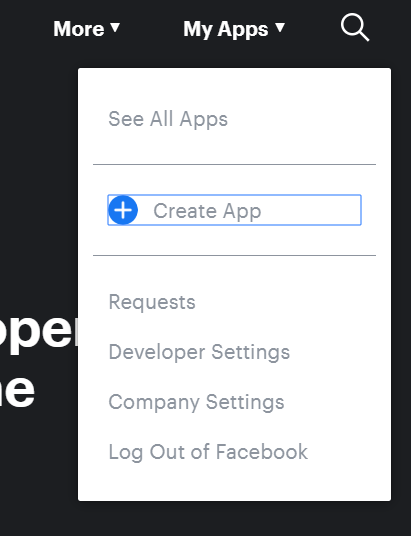
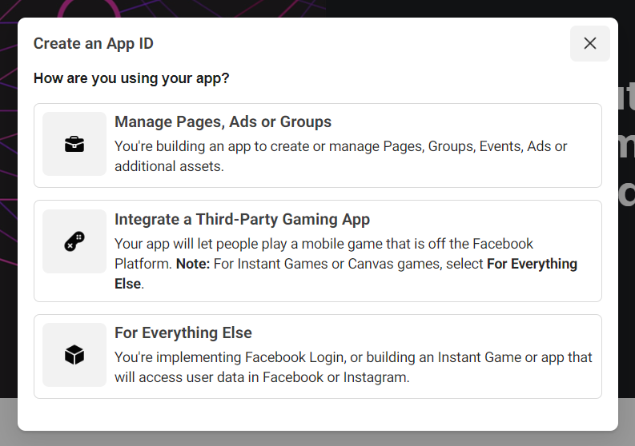
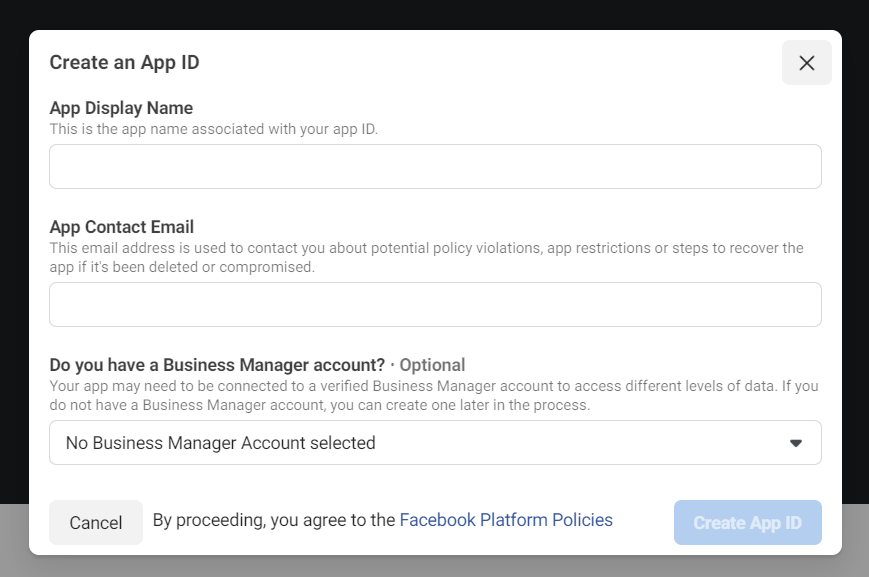
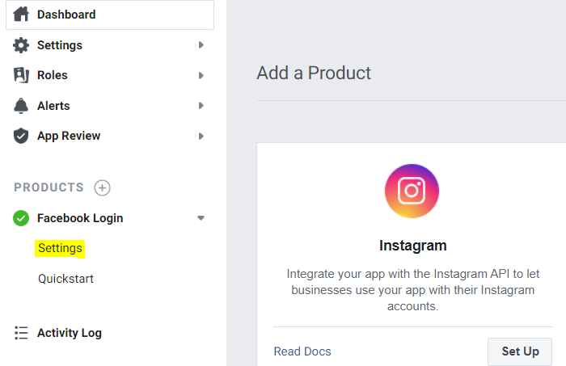
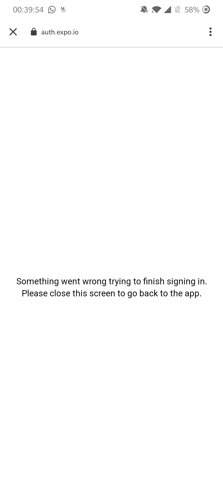
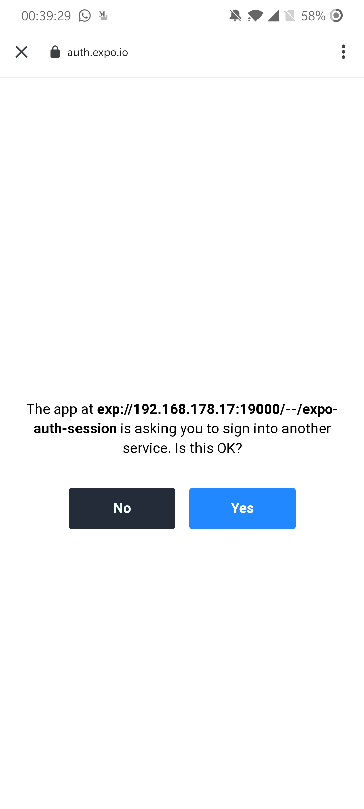
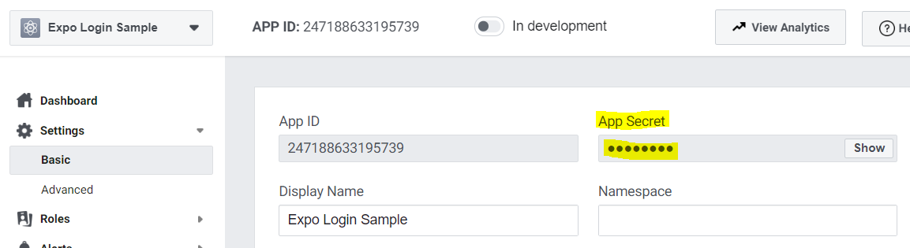

## Preparation

You can type along if you wish. I'll write out _each and every step_. If you already have an application, you can skip this step altogether.

```bash
expo init --template expo-template-blank-typescript --name facebook-login
```

## Install `expo-auth-session`

We're going to use [`AuthSession`][expo-auth-session] to simplify Native Authentication considerably. You could roll your own, but there really is no point. `AuthSession` works by opening a Web Browser session and a standard to authenticate (in this case OAuth).

```bash
expo install expo-auth-session
```

Inside `App.tsx`, or wherever I want to configure the Facebook login, I add the following code snippet:

```tsx{2-8,10-13,15-24,27}
import React from 'react'
import { StyleSheet, Text, View, Platform } from 'react-native'
import {
  useAuthRequest,
  makeRedirectUri,
  AuthRequestConfig,
  DiscoveryDocument
} from 'expo-auth-session'

const discovery: DiscoveryDocument = {
  authorizationEndpoint: 'https://www.facebook.com/v6.0/dialog/oauth',
  tokenEndpoint: 'https://graph.facebook.com/v6.0/oauth/access_token'
}

const config: AuthRequestConfig = {
  clientId: '<YOUR FBID>',
  scopes: ['public_profile', 'user_likes'],
  redirectUri: makeRedirectUri({
    native: 'fb111111111111://authorize'
  }),
  extraParams: {
    display: Platform.select({ web: 'popup' })!
  }
}

export default function App() {
  const [request, response, promptAsync] = useAuthRequest(config, discovery)

  return (
    <View style={styles.container}>
      <Text>Open up App.tsx to start working on your app!</Text>
    </View>
  )
}

const styles = StyleSheet.create({
  container: {
    flex: 1,
    backgroundColor: '#fff',
    alignItems: 'center',
    justifyContent: 'center'
  }
})
```

The `discovery` here is a manual configuration that tells the OAuth authentication protocal _which endpoints_ it should call in order to authenticate a user. This is described in detail in the [OpenID Discovery Document][openid-doc] as well as [RFC 8414: OAuth 2.0 Authorization Server Metadata][rfc8414]. It might be daunting to read such document if you've never done that, so the short story is that there are certain endpoint an OAuth server needs to expose in order to be able to use OAuth to authenticate.

[`useAutoDiscovery`][expo-auto-discovery] (not enabled for Facebook at the moment) automatically retrieves these endpoints based on a single URL. Because Auto-Discovery is not implemented for Facebook, we have to manually configure it.

The `AuthRequestConfig` is the Facebook OAuth configuration, and needs our attention. `clientId` needs to be replaced, as well as the `native` _redirectUri_.

## Create the Facebook Application

Browse to [developers.facebook.com][developers.facebook.com] and create a new application.



On the popup, pick _For Everything Else_, unless you're making a mobile game that's **not** an Instant Game or Canvas Game.



Finally, fill in the **App Display Name** and **App Contact Email**:



When all proceeds as planned, you're greeted by the following screen, with in the top left your **App Display Name** and next to that the actual **APP ID** that you'll need.


## Update the configuration

```tsx{2,5}
const config: AuthRequestConfig = {
  clientId: '247188633195739',
  scopes: ['public_profile', 'user_likes'],
  redirectUri: makeRedirectUri({
    native: 'fb247188633195739://authorize'
  }),
  extraParams: {
    display: Platform.select({ web: 'popup' })!
  }
}
```

It is very important that the `native` `redirectUri` has the correct structure. If you don't use the correct format or ID before the `://`, you'll see:

> No redirect URI in the params: No redirect present in URI

If you don't use the correct path of `authorize`, you'll see:

> Can't Load URL: The domain of this URL isn't included in the app's domains. To be able to load this URL, add all domains and subdomains of your app to the App Domains field in your app settings.

## Add a login button

In this example, I import `Button` from `react-native` and use it to show the login prompt. In your App, use a guideline-branded button instead.

```tsx{6}
export default function App() {
  const [request, response, promptAsync] = useAuthRequest(config, discovery;

  return (
    <View style={styles.container}>
      <Button onPress={() => promptAsync()} title="Login" />
    </View>
  );
}
```

Additionally, I'd like to see the response when we come back to the app:

```tsx{7}
export default function App() {
  const [request, response, promptAsync] = useAuthRequest(config, discovery)

  return (
    <View style={styles.container}>
      <Button onPress={() => promptAsync()} title="Login" />
      <Text>{JSON.stringify(response, undefined, 2)}</Text>
    </View>
  )
}
```

## Test it out

You can now try this out by running `yarn start`, opening your expo client and load your app.

You'll see a warning in your console:

> Linking requires that you provide a `scheme` in app.json for standalone apps - if it is left blank, your app may crash. The scheme does not apply to development in the Expo client but you should add it as soon as you start working with Linking to avoid creating a broken build. Add a `scheme` to silence this warning. Learn more about Linking at https://docs.expo.io/versions/latest/workflow/linking/

Clicking on the Login button correctly pops-up the `m.facebook.com` OAuth (unless you have the Facebook App installed), and displays the following error:

> No redirect URI in the params: No redirect present in URI

I just said that this can be caused when the `native` `redirectUri` is incorrect, and that is the case. Resolution goes as follows:

### Add `scheme` to `app.json`

First, open up `app.json` and add a new "top-level" property `scheme`:

```json{5}
{
  "expo": {
    "name": "facebook-login",
    "slug": "facebook-login",
    "scheme": "com.derk-jan.facebook-login",
    "platforms": ["ios", "android", "web"],
    "version": "1.0.0",
    "orientation": "portrait"
    /* ... */
  }
}
```

I suggest the following format: `reverse.dns.slug`. So, in my case I will use `com.derk-jan.facebook-login`. It's _very_ unlikely that a reverse domain will cause a conflict with another app, and it's also easier to remember. It's recommended by many guides -- occasionally also by Google and Apple, but it's inconsistent.

This removes the warning, but doesn't enable us to use the login. Why? Because we're using the `expo` app, which doesn't have our custom "deeplink scheme".

### Enable proxy for `expo` clients

First, install the Expo web browser and constants packages. The first will be used to resume an `auth session`, when returning to the application; the second will allow us to query if we've launched from the expo client, or a standalone app.

```yarn
expo install expo-constants expo-web-browser
```

Now add the following code to `App.tsx`

```tsx
import { maybeCompleteAuthSession } from 'expo-web-browser'
import Constants from 'expo-constants'

maybeCompleteAuthSession()

const useProxy = Constants.appOwnership === 'expo' && false
```

You can find the values for `Constants.appOwnership` in [the documentation][expo-constants]. [`maybeCompleteAuthSession`][expo-web-browser] is necessary to test this on the `web` -- it closes the redirection popup (which we haven't done so far).

Now let's instruct the `Linking` module to use the proxy:

```tsx{6}
const config: AuthRequestConfig = {
  clientId: '247188633195739',
  scopes: ['public_profile', 'user_likes'],
  redirectUri: makeRedirectUri({
    native: 'fb247188633195739://authorize',
    useProxy
  }),
  extraParams: {
    display: Platform.select({ web: 'popup' })!
  }
}
```

If you try to login now, the original error disappears, but Facebook will still complain that the "domain" to redirect to is not a valid/accepted/allowed one (depending on the language settings of your Facebook account).

### Add the redirection domain

On [developers.facebook.com][developers.facebook.com], go to your app and press the `Facebook Login` button. Now do **not** press any of the options, but instead on the left side in the menu press **Settings**:



When you press it, in the top box, find **Valid OAuth Redirect URIs** and enter the Redirection URI. It will be `https://auth.expo.io/@username/slug` -- but if you're unsure, you can add the following to `App.tsx` and copy it from your console:

```tsx
console.log(
  makeRedirectUri({
    native: 'fb<YOUR APP ID>://authorize',
    useProxy
  })
)
```

_But replace the `fb<YOUR APP ID>` by the actual `appId`, prepended with `fb`_.

In my case it's `https://auth.expo.io/@derk-jan/facebook-login`

## Test it out, again

If you run `yarn start` again and open the app and press the Login button, you should now see a Facebook Login prompt. Pressing continue logs you in _but shows another error_:



We'll fix this in a minute! Let's first test a successful flow on the web.

Open the app on the web by either using `yarn start --web`, or if you're still running the metro-bundler from a few lines ago, type `w` in the console. You can also press `Run in web browser` in the developer console. Press the `Login` button. You should see a pop-up, but if you're already logged in on Facebook in your browser (and have accepted the prompt a minute ago on mobile), it will close and return:

```json
{
  "type": "success",
  "error": null,
  "url": "http://localhost:19006/?code=<...>&state=<...>#_=_",
  "params": {
    "code": "<...>",
    "state": "<...>",
    "_": "_"
  }
}
```

Great. This authenticated me on my device and browser.

## Fixing the proxy message

The reason the proxy on the mobile phone fails to return the `AuthSession` to your app is because the `returnUrl` is _incorrect_. We correctly _start_ the request using the proxy, but we don't tell the proxy to return _via_ the proxy. Make the following change:

```tsx{6}
export default function App() {
  const [request, response, promptAsync] = useAuthRequest(config, discovery;

  return (
    <View style={styles.container}>
      <Button onPress={() => promptAsync({ useProxy })} title="Login" />
      <Text>{JSON.stringify(response, undefined, 2)}</Text>
    </View>
  );
}
```

All I've changed is pass in the `useProxy` value here too. Now launch the login prompt again and rejoice:



Press `Yes` to receive the same response shape, with similar data as on the web:

```json
{
  "type": "success",
  "error": null,
  "url": "exp://192.168.x.y:19000/--/expo-auth-session?code=<...>&state=<...>#_=_",
  "params": {
    "code": "<...>",
    "state": "<...>",
    "_": "_"
  }
}
```

Press `No` to see what a decline or failure looks like.

## Am I done?

If all you wanted to do was authenticate a user, you'd sorta be done, but you probably want to use the code you got back in order to create a user, login a user, or retrieve some data at a later moment. **The data you've received is not secure**. From the [Facebook Documentation][facebook-docs]:

> Because this redirect flow involves browsers being redirected to URLs in your app from the Login dialog, traffic could directly access this URL with made-up fragments or parameters. If your app assumed these were valid parameters, the made-up data would be used by your app for potentially malicious purposes. As a result, your app should confirm that the person using the app is the same person that you have response data for before generating an access token for them.

Now let me make the following thing _very clear_:

- You need to take the returned `code` and exchange it for an `access token`.
- You will need to use a _server_ secret.
- You will need to use a _server_ to use a _server secret_.
- ⚠ You **can not** do this in your app. There is **no way** to bundle a secret and keep it _actually secret_. Again: you will need a server or some serverless code.

## Exchanging `code` for an access token

Luckily, the code you need to run to exchange the code for an access token is not extensive and consists of a _single_ HTTP GET call:

```text
https://graph.facebook.com/v7.0/oauth/access_token
   ?client_id={app-id}
   &redirect_uri={redirect-uri}
   &client_secret={app-secret}
   &code={code-parameter}
```

### Retrieve the App Secret

Go back to [developers.facebook.com][developers.facebook.com] once more, and on the left side, in the menu, press the Settings item > Basic.



Okay great. Let's assume the value is `26d63d5f1af0470e88da15e88c128ee0`. Replace the `{app-secret}` template variable:

```diff
  https://graph.facebook.com/v7.0/oauth/access_token
     ?client_id={app-id}
     &redirect_uri={redirect-uri}
-    &client_secret={app-secret}
+    &client_secret=26d63d5f1af0470e88da15e88c128ee0
     &code={code-parameter}
```

### Fill in the other values

You can also enter the `{app-id}`:

```diff
  https://graph.facebook.com/v7.0/oauth/access_token
-    ?client_id={app-id}
+    ?client_id=YOUR_APP_ID
     &redirect_uri={redirect-uri}
     &client_secret=26d63d5f1af0470e88da15e88c128ee0
     &code={code-parameter}
```

Finally, you need to send the `config['redirectUri']` and the retrieved `response['params']['code']` value up to your server:

- The `config` object was the value we passed to `useAuthRequest(config, discovery)`. You MUST use this `redirectUri` to exchange the `code` for an Access Token.
- The `response` object is the second value returned from `const [request, response, promptAsync] = useAuthRequest(config, discovery)`.
  - Check if `response['type'] === 'success'`
  - Collect `response['params']['code']`
  - Make a request to your own server with these values:

```diff
  https://graph.facebook.com/v7.0/oauth/access_token
     ?client_id=YOUR_APP_ID
-    &redirect_uri={redirect-uri}
+    &redirect_uri=https://auth.expo.io/@derk-jan/facebook-login
     &client_secret=26d63d5f1af0470e88da15e88c128ee0
-    &code={code-parameter}
+    &code=<...>
```

## Sending these values up from the client

Perhaps your server lives at `your.personal.server.com` and it accepts `POST` requests to `/that-will-exchange-the-token` with `application/json` body. If the body is valid, the server will exchange it for an access token, retrieve the user id from Facebook and use that to find or create a user on `your.personal.server.com`. It would then return some user data as JSON:

```tsx{12-25}
function App() {
  const [request, response, promptAsync] = useAuthRequest(config, discovery)

  useEffect() {
    // Was not successful
    if (!response || response['type'] !== 'success') {
      return
    }

    let stillCareAboutThis = true

    fetch(
      'your.personal.server.com/that-will-exchange-the-token',
      {
        method: 'POST',
        headers: {
          'accept': 'application/json',
          'content-type': 'application/json; charset=utf-8'
        },
        body: JSON.stringify({
          redirectUri: config['redirectUri']
          code: response['params']['code']
        })
      },
    )
    .then(handleResponse)
    .then((user) => {
      // Replace with success handing
      stillCareAboutThis && console.log(user)
    })
    .catch((err) => {
      // Replace with error handling
      stillCareAboutThis && console.error(err)
    })

    return () => {
      stillCareAboutThis = false
    }
  }, [response])


  // ...
}
```

The function `handleResponse` is not given, but should probably deal with `response.ok`, check the `Content-Type` header, and decide if it was a success or failure. The result of this function should be a resolved `Promise` with a user when successful, or a rejected `Promise` with an error. This can also be accomplished by returning a `user` directly, or throwing an `Error`.

## Handling the request on the server

On the server you can use any HTTP library to accomplish this, as long as it's making a `GET` HTTP request. You may optionally choose to supply a `Accept: application/json` header, but there will not be any Content-Negotiation (this value will not be used to determine what the response looks like).

```diff
https://graph.facebook.com/v7.0/oauth/access_token
  ?client_id=YOUR_APP_ID
  &redirect_uri=https://auth.expo.io/@derk-jan/facebook-login
  &client_secret=26d63d5f1af0470e88da15e88c128ee0
  &code=<...>
```

The response looks like this when successful:

```json
{
  "access_token": {access-token},
  "token_type": {type},
  "expires_in":  {seconds-til-expiration}
}
```

The response will explain what went wrong when it fails:

```json
{
  "error": {
    "message": "This authorization code has been used.",
    "type": "OAuthException",
    "code": 100,
    "error_subcode": { number },
    "fbtrace_id": { string }
  }
}
```

## Conclusion

It's not difficult to add Facebook authentication to your application, thanks to `expo-auth-session`. This step to step guide was up-to-date at the moment of writing, but might be outdated by the time you read it. I recommend you check the [Expo][exp-auth-session] and [Facebook][facebook-docs] documentation when you're implementing this.

[developers.facebook.com]: https://developers.facebook.com/
[facebook-docs]: https://developers.facebook.com/docs/facebook-login/manually-build-a-login-flow/
[rfc8414]: https://tools.ietf.org/html/rfc8414
[openid-doc]: https://openid.net/specs/openid-connect-discovery-1_0.html#rfc.section.4.2
[expo-auto-discovery]: https://docs.expo.io/versions/latest/sdk/auth-session/#useautodiscovery
[exp-auth-session]: https://docs.expo.io/versions/latest/sdk/auth-session/
[expo-constants]: https://docs.expo.io/versions/latest/sdk/constants/#constantsappownership
[expo-web-browser]: https://docs.expo.io/versions/v37.0.0/sdk/webbrowser/#webbrowsermaybecompleteauthsessionoptions
